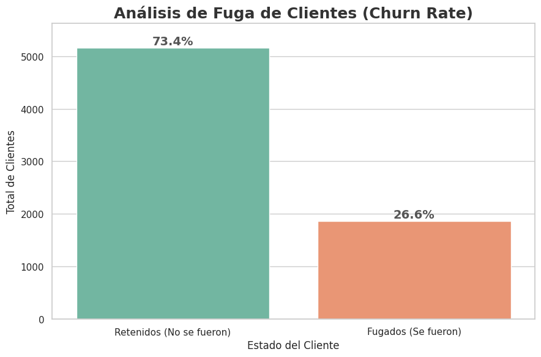
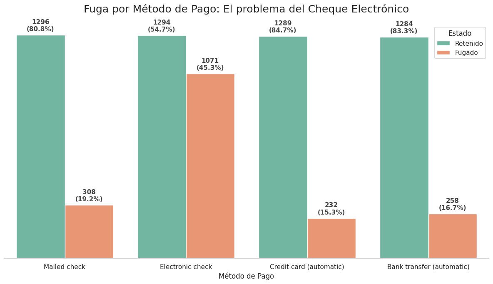
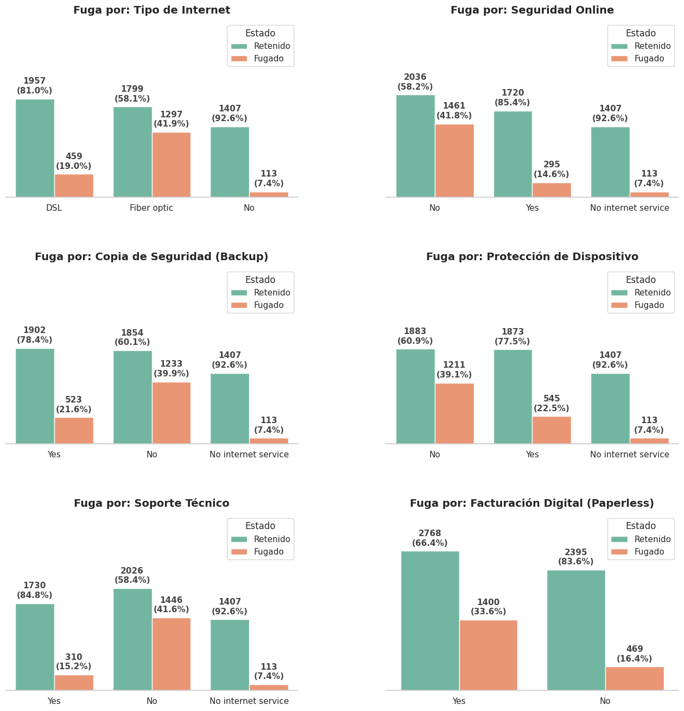
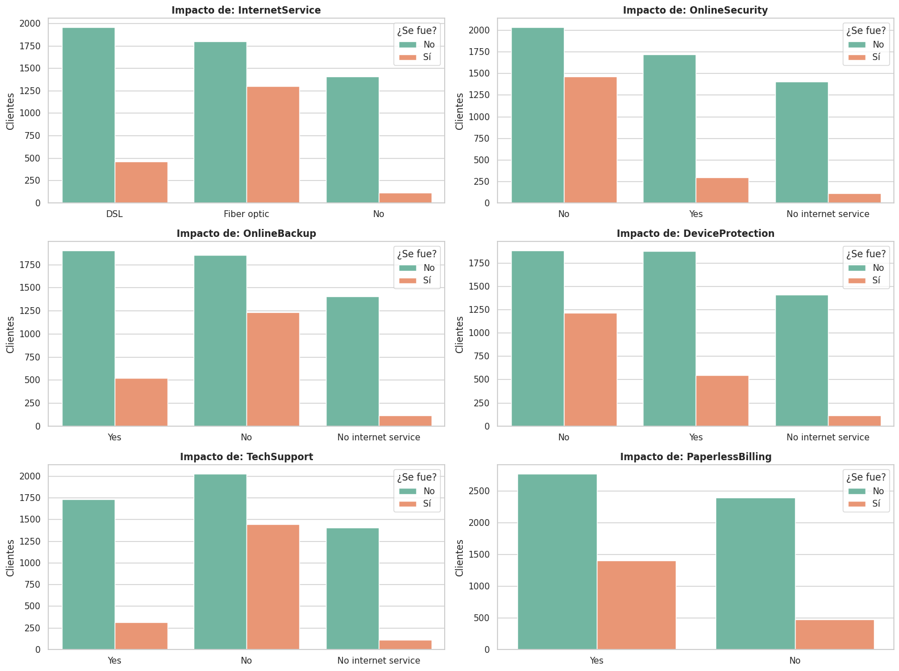
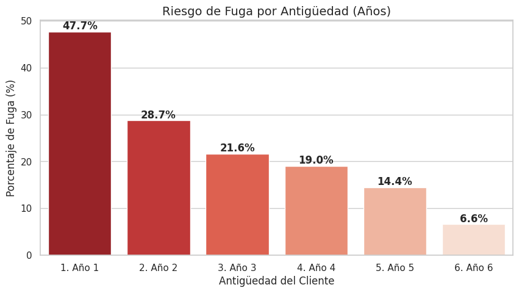
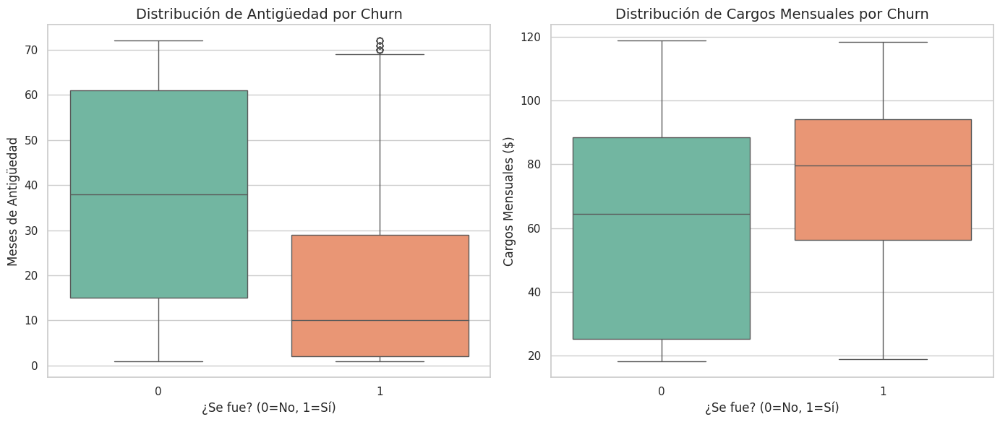
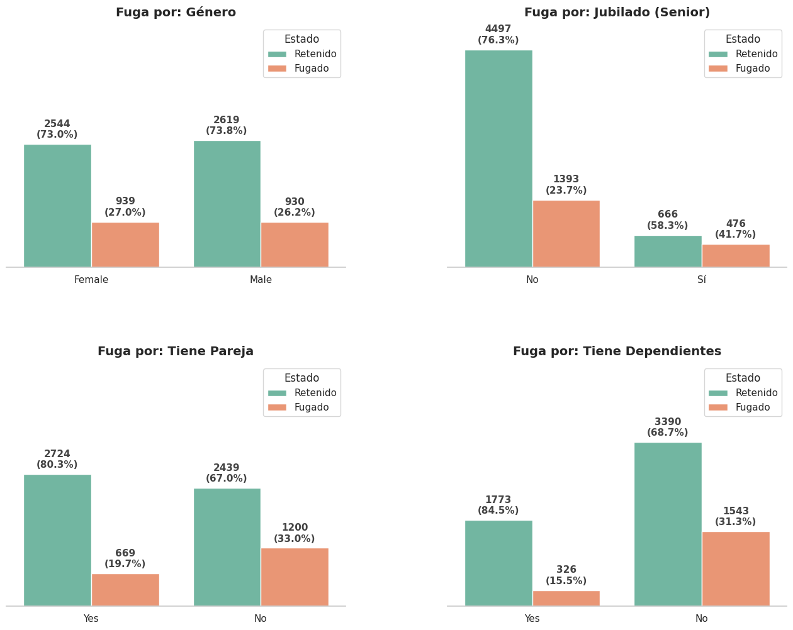

# 📉 Análisis de Fuga de Clientes (Customer Churn) - Telecom X

## 📋 Descripción del Proyecto
Este proyecto analiza el comportamiento de los clientes de una empresa de telecomunicaciones para identificar las causas principales de la cancelación de servicios (Churn). El objetivo es transformar datos crudos en insights accionables para reducir la tasa de fuga del **26.5%** actual.

## 🛠️ Tecnologías Utilizadas
* **Python:** Lenguaje principal.
* **Pandas:** Limpieza y manipulación de datos (ETL).
* **Seaborn / Matplotlib:** Visualización de datos y storytelling.
* **Jupyter Notebook:** Entorno de desarrollo.

## 📊 Principales Hallazgos (Insights)
Tras analizar más de 7,000 registros, se detectaron los siguientes patrones de riesgo:

1.  **Tipo de Contrato:** 

Lo primero que descubrí es el factor más determinante: el Contrato. Como pueden ver en este gráfico, el 42.7% de los clientes con contrato mensual se van. En cambio, en los contratos de dos años, la fuga es casi inexistente. Aquí está nuestra mayor oportunidad de retención.

Por lo tanto, *el contrato "Mes a Mes" es el factor #1 de fuga (42.7% de tasa de cancelación), mientras que los contratos anuales "blindan" al cliente.*

   - Clientes que se quedaron: 5163
   - Clientes que se fueron:   1869
   - Tasa de Fuga (Churn):     26.58%

2.  **Método de Pago:** 

Se detectó que este método de pago específico actúa como un disparador de fuga. A diferencia de los pagos automáticos (Tarjeta de Crédito/Débito) que son "invisibles" y generan retención pasiva, el Cheque Electrónico requiere una acción mensual consciente del usuario.

Este método genera  "incomodidad de pago" que obliga al cliente a re-evaluar la utilidad del servicio cada mes. Además, suele estar asociado a segmentos de clientes con menor adopción de la digitalización financiera o mayor sensibilidad al gasto.

Por ende, *los usuarios que pagan con *Electronic Check* tienen una tasa de deserción inusualmente alta.*

La *estrategia* aquí no es eliminar el cheque electrónico, sino incentivar el cambio. Deberíamos ofrecer un descuento de $5 dólares o un beneficio extra (más gigas) a los usuarios que migren su pago a Tarjeta de Crédito Automática. Así reducimos la fricción y aseguramos la recurrencia.

3.  **Problema en Fibra Óptica:** 

Al analizar los productos, encontré una alerta roja en la Fibra Óptica. Miren la barra naranja: la tasa de cancelación es altísima comparada con el DSL. Esto nos indica que hay un problema de satisfacción específico con este producto que debemos investigar.

Es decir, que *el servicio de Fibra Óptica presenta una tasa de cancelación superior al 40%, sugiriendo problemas técnicos o de precio en este producto específico.*

4.  **Efecto Ancla:** 

Los datos confirman la hipótesis de "Adherencia por Servicios". Se observó una correlación inversa entre la cantidad de productos contratados y la tasa de fuga. Los servicios complementarios como Online Security, Tech Support y Online Backup actúan como "anclas".

Estos servicios elevan los Costos de Cambio (Switching Costs) para el usuario. Al integrar múltiples soluciones en una sola factura, la complejidad logística de cambiar de proveedor aumenta, lo que desincentiva la cancelación impulsiva. El cliente deja de comprar un "servicio" para comprar un "ecosistema".

Por lo tanto, cuantos más servicios adicionales tiene un cliente (Seguridad, Backup, Soporte), menor es su probabilidad de irse.

La *recomendación* es dejar de vender el únicamente Internet. Debemos crear paquetes (bundles) donde el servicio de Seguridad o Backup venga incluido por defecto o a un precio ridículamente bajo. Aunque perdamos un poco de margen en ese servicio extra, estamos comprando la fidelidad del cliente a largo plazo.

5.  **La "Zona de Peligro":** 

Finalmente, analizando la antigüedad, vemos que el riesgo está al principio. Si logramos que el cliente supere el primer año, se convierte en un cliente fiel.

Por lo tanto, *la mayoría de las fugas ocurren en los primeros 12 meses de antigüedad.*

## 🔬 Análisis Técnico Profundo (Deep Dive)

Para asegurar la validez de los hallazgos, se realizaron análisis estadísticos complementarios:

### 1. Matriz de Correlación (Heatmap)
Se analizó la correlación entre variables numéricas para detectar relaciones ocultas.
* **Validación:** Se confirmó matemáticamente que no existe colinealidad grave entre variables independientes.
* **Hallazgo:** Se visualizó la correlación negativa (inversa) entre la cantidad de servicios contratados y la variable *Churn*, validando la hipótesis del "Efecto Ancla".

### 2. Distribución y Outliers (Boxplots)
Se utilizaron diagramas de caja para entender la dispersión de los datos.
* **Antigüedad (Tenure):** El boxplot reveló claramente que la mediana de antigüedad de los clientes que se van es muy baja (aprox. 10 meses), mientras que los clientes leales tienen una mediana superior a los 30 meses.
* **Cargos Mensuales:** Se descartó la presencia de *outliers* extremos que pudieran sesgar el modelo, confirmando que los datos de facturación son consistentes.

### 3. Análisis Demográfico
Se exploraron variables como Género, Jubilados y Pareja.
* **Resultado:** Se descubrió que el género no influye en la decisión de fuga (50/50), lo que permite al equipo de marketing descartar segmentaciones por sexo y enfocarse en comportamiento de consumo.

## 🚀 Recomendaciones de Negocio

* **Campaña de Fidelización:** Incentivar la migración de contratos mensuales a anuales.
* **Auditoría Técnica:** Revisar la calidad del servicio de Fibra Óptica.
* **Estrategia de Ventas:** Ofrecer paquetes (bundles) con servicios de seguridad para aumentar la retención (Efecto Ancla).

*Proyecto realizado como parte del Desafío de Data Science - Alura Latam / ONE.*

## ✍️ Autor
Jacqueline Rioja
Desafío Alura LATAM – Data Analysis
Diseñadora de soluciones analíticas con enfoque visual, estratégico y colaborativo.
